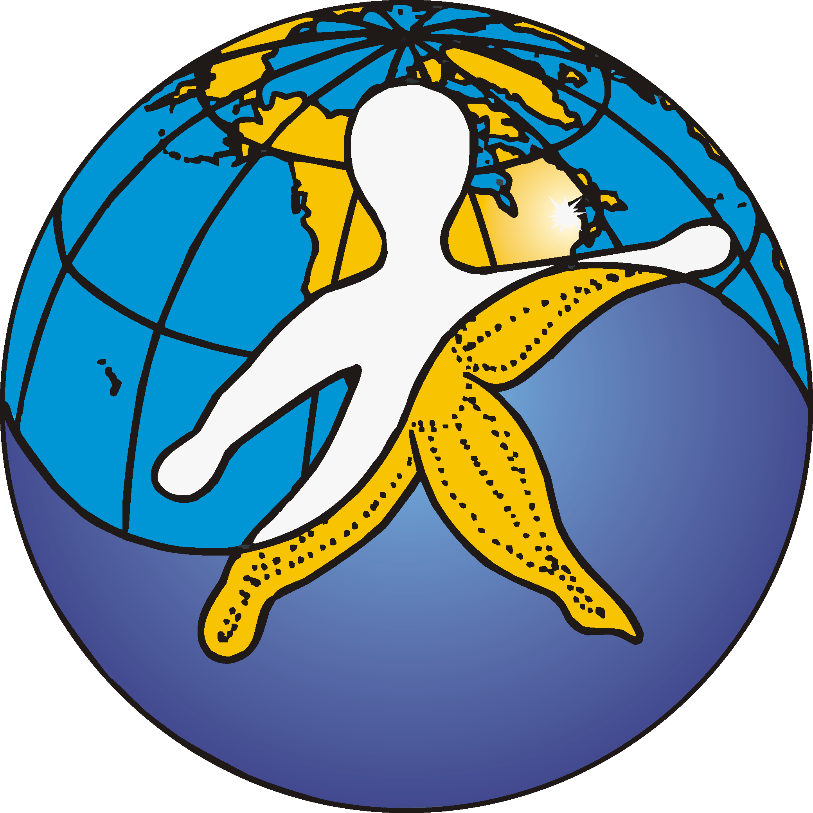
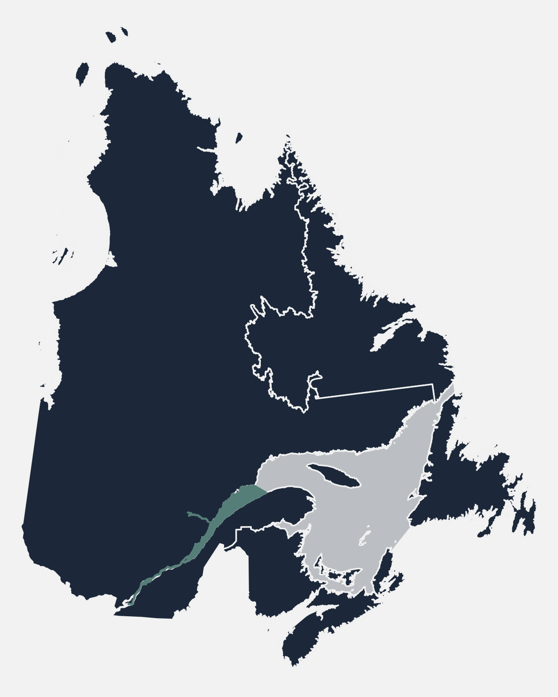

```{r setup, include=FALSE}
source('_setup.R')
# knitr::clean_cache(TRUE)
htmltools::tagList(
  xaringanExtra::use_clipboard(
    button_text = "<i class=\"fa fa-clipboard\"></i>",
    success_text = "<i class=\"fa fa-check\" style=\"color: #37abc8\"></i>",
  ),
  rmarkdown::html_dependency_font_awesome()
)
# xaringanExtra::use_scribble()

cols <- c('#777777','#d66666','#f0f518','#2eb8dd','#6a8868')
```


class: title-slide, middle


# Effets cumulatifs des activités maritimes sur le Saint-Laurent et la rivière Saguenay - Projet pilote

<center></img></center>

<center><i>David Beauchesne, Cindy Grant & Philippe Archambault</i></center>

<span class="br2"></span>

<center>
<a href="https://www.ulaval.ca/"></img></a>
&nbsp;&nbsp;&nbsp;&nbsp;&nbsp;&nbsp;&nbsp;&nbsp;&nbsp;&nbsp;
</img>
<!-- &nbsp;&nbsp;&nbsp;&nbsp;&nbsp;
</img> -->
</center>

<span class="br2"></span>

#### Présentation du rapport final

#### 2022-03-23

<!-- #### [English version](https://github.com/EffetsCumulatifsNavigation/2022-03-TC-webinaire_ceanav) -->


---


class: inverse, center, middle

# Équipe de travail

<html><div style='float:left'></div><hr color='#ffdd55' style="margin-top:-30px" size=1px width=720px></html>

---

# Équipe de travail

<br/>

<center>
<div class="divTable team">
<div class="divTableBody">
<div class="divTableRow">
<div class="divTableCell">

</div><div class="divTableCell">

</div><div class="divTableCell">

</div></div>
<div class="divTableRow">
<div class="divTableCell"><b>David Beauchesne</b></div><div class="divTableCell"><b>Cindy Grant</b></div><div class="divTableCell"><b>Philippe Archambault</b></div></div>
</div>
</center>


---

class: inverse, center, middle

# Effets cumulatifs - activités maritimes

<html><div style='float:left'></div><hr color='#ffdd55' style="margin-top:-30px" size=1px width=720px></html>

#### Contexte
### Portée de l'évaluation
### Méthode d'analyse 
### Portrait 
### Résultats
### Perspectives

---

# Contexte 

.pull-left[
## Initiative nationale 

.font90[
- Cadre national d'évaluation des effets cumulatifs
- Évaluations régionales (6)
]

## Fleuve Saint-Laurent (QC)

.font90[
- Gouvernement du Canada 
- Gouvernement du Québec 
- Premières Nations 
  - Nation Huronne-Wendat
  - Nation des Innus d’Essipit
  - Nation Mohawk de Kahnawà:ke
  - Nation Wolastoqiyik Wahsipekuk
  - Nation W8banaki 
- Intervenants locaux
- Organisations non-gouvernementales
]
]

.pull-right[
<center></img></center>

<a href='https://www.donneesquebec.ca/'></a>
<a href='https://ogsl.ca/fr/accueil/'></a> 
<a href='https://open.canada.ca/fr'></a>


<!-- <a href='https://open.canada.ca/fr'></a>
<a href='https://ogsl.ca/fr/accueil/'></a> 
<a href='https://www.donneesquebec.ca/'></a> -->
]

---

class: inverse, center, middle

# Effets cumulatifs - activités maritimes

<html><div style='float:left'></div><hr color='#ffdd55' style="margin-top:-30px" size=1px width=720px></html>

### Contexte
#### Portée de l'évaluation
### Méthode d'analyse
### Portrait 
### Résultats
### Perspectives

---

# Portée de l'évaluation

## Objectifs général

*Développer une méthodologie d'analyse effectuer une évaluation des effets cumulatifs des activités maritimes dans le Saint-Laurent (tronçon fluvial et estuaire) et la rivière Saguenay (partie en eau profonde) au Québec*

<br>

--
## Objectifs spécifiques 

- Caractériser l'intensité et la distribution spatiale de stresseurs environnementaux issus d'activités maritimes;

--
- Caractériser la structure spatiale des composantes valorisées identifiées;

--
- Évaluer la vulnérabilité des composantes valorisées aux stresseurs environnementaux;

--
- Évaluer les effets cumulatifs des stresseurs environnementaux sur les composantes valorisées


---

# Portée de l'évaluation

## Portée spatiale et temporelle &nbsp;&nbsp; <a href="maps/sa.html" target="_blank">`r mp()`</a>

.pull-left2[
#### Étendue spatiale

- Ouest: Châteaugay
- Est : Pointe-des-Monts et Cap-Chat
- Saguenay : Saint-Fulgence

#### Grille d'étude

- Cellules $1km^2$

#### Limites temporelles 

- Évaluation contemporaine 
- ~2000-2020 selon la disponibilité des données
]

.pull-right2[

]


---

# Portée de l'évaluation

## Stresseurs environnementaux & composantes valorisées

<br/>

<center></img></center>


--
`r tr()` .font80[Bien que le terme ***stresseur*** suggère des effets négatifs, un stresseur peut n'avoir aucun effet, ou même exercer un effet positif, sur une composante valorisée]

---
# Portée de l'évaluation 

## Limites et considérations particulières

### Interprération balisée par la portée de l'étude

Limites spatiales et temporelles <br>
Stresseurs environnementaux <br>
Composantes valorisées

--
### Évaluation sectorielle centrée sur les activités maritimes 

--
### Composantes valorisées spécifiques à ce projet 

--
### Évaluation basée sur des données existantes


---

class: inverse, center, middle

# Effets cumulatifs - activités maritimes

<html><div style='float:left'></div><hr color='#ffdd55' style="margin-top:-30px" size=1px width=720px></html>

### Contexte
### Portée de l'évaluation
#### Méthode d'analyse
### Portrait 
### Résultats
### Perspectives

---

# Méthode d'analyse

<center></img></center>

.references[
Halpern et al. 2008; Halpern et al. 2015
]


---

# Méthode d'analyse

<center></img></center>


.references[
Halpern et al. 2008; Halpern et al. 2015
]

---

# Méthode d'analyse

<br/><br/>

<center></img></center>

.references[
Halpern et al. 2008; Halpern et al. 2015
]

---

# Méthode d'analyse

<center></img></center>

.references[
Halpern et al. 2008; Halpern et al. 2015
]

---

# Méthode d'analyse

<center></img></center>

.references[
Halpern et al. 2008; Halpern et al. 2015
]

---

class: inverse, center, middle

# Effets cumulatifs - activités maritimes

<html><div style='float:left'></div><hr color='#ffdd55' style="margin-top:-30px" size=1px width=720px></html>

### Contexte
### Portée de l'évaluation
### Méthode d'analyse
#### Portrait 
### Résultats
### Perspectives

---

# Portrait <a href='https://github.com/EffetsCumulatifsNavigation/ceanav'></a>

## Collecte et gestion de données 

--
- Données existantes 

--

- Consultation parties impliquées 

--
- Priorisation données ouvertes 
<a href='https://open.canada.ca/fr'></a>
<a href='https://ogsl.ca/fr/accueil/'></a> 
<a href='https://www.donneesquebec.ca/'></a>

--

- Ententes de partages de données

--
- Transparence et reproductibilité &nbsp; `r rp()` `r gh()` <a href='https://github.com/EffetsCumulatifsNavigation/ceanav'></a>
- Compendium de recherche ***ceanav***
- Partage sur le portail de l'OGSL .font60[`r tr()` en cours]

---

# Portrait 

## Stresseurs environnementaux

---

# Portrait 

## Composantes valorisées 

---

# Portrait 

## Vulnérabilité

---

class: inverse, center, middle

# Effets cumulatifs - activités maritimes

<html><div style='float:left'></div><hr color='#ffdd55' style="margin-top:-30px" size=1px width=720px></html>

### Contexte
### Portée de l'évaluation
### Méthode d'analyse
### Portrait 
#### Résultats
### Perspectives

---

# Résultats

## Stresseurs cumulés

.pull-left2[

]
.pull-right2[

]

---

# Résultats

## Composantes valorisées cumulées

.pull-left2[

]
.pull-right2[

]

---

# Résultats

## Effets cumulatifs

.pull-left2[

]
.pull-right2[

]

---

# Résultats

## Contribution régionale

.pull-left2[

]
.pull-right2[

]

---

# Résultats

## Régions administratives

.pull-left2[

]
.pull-right2[

]

---

# Résultats 

## Constats généraux

---

class: inverse, center, middle

# Effets cumulatifs - activités maritimes

<html><div style='float:left'></div><hr color='#ffdd55' style="margin-top:-30px" size=1px width=720px></html>

### Contexte
### Portée de l'évaluation
### Méthode d'analyse
### Portrait 
### Résultats
#### Perspectives

---

# Perspectives 

- List of perspectives 

---

# Remerciements 

Thank organizations, contributors, collaborators

---


---

# Évaluation des effets cumulatifs

.references[
Loi canadienne sur l'évaluation environnementale (1992)
]

**Évaluation d'impact** : *Évaluation des effets d’un projet désigné effectuée conformément à la Loi sur l’évaluation d’impact (Canada).‍ Ou Évaluation de tout projet encadré par la procédure d’évaluation et d’examen des impacts sur l’environnement prévue en vertu de la Loi sur la qualité de l’environnement (Québec).‍*

--

**Effets cumulatifs** : *[...] les effets cumulatifs que [la] réalisation [d’un projet], combinée à l’existence d’autres ouvrages ou à la réalisation d’autres projets ou activités, est susceptible de causer à l’environnement*.

--

**Évaluation des effets cumulatifs** : *procédure systématique qui vise à identifier, à analyser et à évaluer les effets cumulatifs.*

<!--
https://www.parl.ca/DocumentViewer/fr/42-1/projet-loi/C-69/sanction-royal
https://www.canada.ca/fr/agence-evaluation-impact/services/politiques-et-orientation/evaluation-regionale-la-loi-evaluation-impact.html
-->


---

class: inverse, center, middle

# Étapes

<html><div style='float:left'></div><hr color='#ffdd55' style="margin-top:-30px" size=1px width=720px></html>

---

# Étapes

1. Identifier, impliquer et communiquer avec les parties prenantes de l’évaluation

--
2. Portée de l’évaluation <!-- (objectifs, limites, activités, facteurs de stress, composantes valorisées) -->

--
3. Portrait de la zone à l'étude
    * Activités et facteurs de stress
    * Composantes valorisées
    * Vulnérabilité
--
4. Analyse des effets cumulatifs

--
5. Résultats de l'évaluation

--
6. Processus décisionnels et de gestion

--
7. Suivi et gestion adaptative


---

# Étapes

1. **<span style="color:#c13319;">Identifier, impliquer et communiquer avec les parties prenantes de l’évaluation</span>**
2. Portée de l’évaluation
3. Portrait de la zone à l'étude
    * Activités et facteurs de stress
    * Composantes valorisées
    * Vulnérabilité
4. Analyse des effets cumulatifs
5. Résultats de l'évaluation
6. Processus décisionnels et de gestion
7. Suivi et gestion adaptative

<p style="font-size:17px; line-height:1.4">
<i class="fas fa-arrow-circle-right" style="color:#c13319;"></i> Tout au long du processus
</p>


---

# Étapes

1. <span style="color:#c13319;">Identifier, impliquer et communiquer avec les parties prenantes de l’évaluation</span>
2. **<span style="color:#1989c1;">Portée de l’évaluation</span>**
3. Portrait de la zone à l'étude
    * Activités et facteurs de stress
    * Composantes valorisées
    * Vulnérabilité
4. Analyse des effets cumulatifs
5. Résultats de l'évaluation
6. Processus décisionnels et de gestion
7. Suivi et gestion adaptative

<p style="font-size:17px; line-height:1.4">
<i class="fas fa-arrow-circle-right" style="color:#c13319;"></i> Tout au long du processus <br/>
<i class="fas fa-arrow-circle-right" style="color:#1989c1;"></i> Préalablement identifié
</p>

---

# Étapes

1. <span style="color:#c13319;">Identifier, impliquer et communiquer avec les parties prenantes de l’évaluation</span>
2. <span style="color:#1989c1;">Portée de l’évaluation</span>
3. **<span style="color:#FECA2C;">Portrait de la zone à l'étude</span>**
    * **<span style="color:#FECA2C;">Activités et facteurs de stress</span>**
    * **<span style="color:#FECA2C;">Composantes valorisées</span>**
    * **<span style="color:#FECA2C;">Vulnérabilité</span>**
4. **<span style="color:#FECA2C;">Analyse des effets cumulatifs</span>**
5. **<span style="color:#FECA2C;">Résultats de l'évaluation</span>**
6. Processus décisionnels et de gestion
7. Suivi et gestion adaptative

<p style="font-size:17px; line-height:1.4">
<i class="fas fa-arrow-circle-right" style="color:#c13319;"></i> Tout au long du processus<br/>
<i class="fas fa-arrow-circle-right" style="color:#1989c1;"></i> Préalablement identifié<br/>
<i class="fas fa-arrow-circle-right" style="color:#FECA2C;"></i> Travail effectué par notre équipe
</p>


---

# Étapes

1. <span style="color:#c13319;">Identifier, impliquer et communiquer avec les parties prenantes de l’évaluation</span>
2. <span style="color:#1989c1;">Portée de l’évaluation</span>
3. <span style="color:#FECA2C;">Portrait de la zone à l'étude</span>
    * <span style="color:#FECA2C;">Activités et facteurs de stress</span>
    * <span style="color:#FECA2C;">Composantes valorisées</span>
    * <span style="color:#FECA2C;">Vulnérabilité</span>
4. <span style="color:#FECA2C;">Analyse des effets cumulatifs</span>
5. <span style="color:#FECA2C;">Résultats de l'évaluation</span>
6. **<span style="color:#999999;">Processus décisionnels et de gestion</span>**
7. **<span style="color:#999999;">Suivi et gestion adaptative</span>**

<p style="font-size:17px; line-height:1.4">
<i class="fas fa-arrow-circle-right" style="color:#c13319;"></i> Tout au long du processus<br/>
<i class="fas fa-arrow-circle-right" style="color:#1989c1;"></i> Préalablement identifié<br/>
<i class="fas fa-arrow-circle-right" style="color:#FECA2C;"></i> Travail effectué par notre équipe<br/>
<i class="fas fa-arrow-circle-right" style="color:#999999;"></i> Étapes non-incluses au contrat
</p>

---

# Étapes

1. <span style="color:#c13319;">Identifier, impliquer et communiquer avec les parties prenantes de l’évaluation</span>
2. <span style="color:#1989c1;">Portée de l’évaluation</span>
3. **<span style="color:#429a6d;">Portrait de la zone à l'étude</span>**
    * **<span style="color:#429a6d;">Activités et facteurs de stress</span>**
    * **<span style="color:#429a6d;">Composantes valorisées</span>**
    * <span style="color:#FECA2C;">Vulnérabilité</span>
4. <span style="color:#FECA2C;">Analyse des effets cumulatifs</span>
5. <span style="color:#FECA2C;">Résultats de l'évaluation</span>
6. Processus décisionnels et de gestion
7. Suivi et gestion adaptative

<p style="font-size:17px; line-height:1.4">
<i class="fas fa-arrow-circle-right" style="color:#c13319;"></i> Tout au long du processus<br/>
<i class="fas fa-arrow-circle-right" style="color:#1989c1;"></i> Préalablement identifié<br/>
<i class="fas fa-arrow-circle-right" style="color:#FECA2C;"></i> Travail effectué par notre équipe<br/>
<i class="fas fa-arrow-circle-right" style="color:#999999;"></i> Étapes non-incluses au contrat<br/><br/>
<i class="fas fa-arrow-circle-right" style="color:#429a6d;"></i> Webinaire d'avancement (aujourd'hui)<br/>
</p>

---

class: inverse, center, middle

# Portée de l'évaluation

<html><div style='float:left'></div><hr color='#ffdd55' style="margin-top:-30px" size=1px width=720px></html>


---

# Portée de l'évaluation

## Stresseurs environnementaux & composantes valorisées

<br/>

<center></img></center>


---

# Portée de l'évaluation


---

class: inverse, center, middle

# Méthode d'analyse d'analyse

<html><div style='float:left'></div><hr color='#ffdd55' style="margin-top:-30px" size=1px width=720px></html>

## Court rappel


---

class: inverse, center, middle

# Collecte de données et cartographie

<html><div style='float:left'></div><hr color='#ffdd55' style="margin-top:-30px" size=1px width=720px></html>

<h2 style="color:#ffdd55;"><b>Zone d'étude</b></h2>
<h2>Stresseurs environnementaux</h2>
<h2>Composantes valorisées</h2>

---


---

class: inverse, center, middle

# Collecte de données et cartographie

<html><div style='float:left'></div><hr color='#ffdd55' style="margin-top:-30px" size=1px width=720px></html>

<h2>Zone d'étude</h2>
<h2 style="color:#ffdd55;"><b>Stresseurs environnementaux</b></h2>
<h2>Composantes valorisées</h2>


---

# Stresseurs environnementaux

## Ancrages &nbsp; <a href="maps/ancrage.html" target="_blank">`r mp()`</a> &nbsp; `r db(cols[2])`


.references[
0012
]

--

**Sources**

- Système d’information sur la gestion du trafic maritime (SIGTM-INNAV)
- Garde côtière canadienne, Pêches et Océans Canada

<!--
- Vessel Traffic Management Information System (VTMIS-INNAV)
- Canadian Coast Guard, Fisheries and Oceans Canada
-->


--

**Description**

- Localisations des sites d'ancrages dans l'Est du Canada

<!--
Eastern Canada anchorage locations
-->

--

**Traitement**

- Nombre de sites d'ancrages dans un rayons de 5 km

<!--
Number of anchorage sites in a 5km radius
-->


---

# Stresseurs environnementaux

## Déversements accidentels &nbsp; <a href="maps/deversement.html" target="_blank">`r mp()`</a> &nbsp; `r db(cols[5])`


.references[
0013
]

--

**Sources**

- Garde côtière canadienne, Pêches et Océans Canada

<!--
- Canadian Coast Guard, Fisheries and Oceans Canada
-->


--

.pull-left[
**Description**

- Localisations et volumes des déversements accidentels répertoriés entre 2016 et 2020
- Catégories:
  - Hydrocarbures
  - Autres (*ex.* eau de ballast, huile, eaux usées)
  - Inconnus (origine et contenu inconnu)

<!--
- location and volumes of incidental spills between 2016 and 2020
- Categories:
  - Hydrocarbon
  - Ohters (*ex.* ballast, oil, waste water)
  - Unknown (unknown content and origin)

-->
]

--

.pull-right[
**Traitement**

- Catégories volumes déversés
  - 1 = 0 l
  - 2 = 0-100 l
  - 3 = 100-1000 l
  - 4 = 1000-7000 l
  - 5 = 100000-1000000 l
- Somme des catégories de volumes dans un rayon de 5 km
]

<!--
- Spill volumes categories
  - 1 = 0 l
  - 2 = 0-100 l
  - 3 = 100-1000 l
  - 4 = 1000-7000 l
  - 5 = 100000-1000000 l
- Sum of volume categories in a 5 km radius
-->


---

# Stresseurs environnementaux

## Dragage &nbsp; `r db(cols[1])`


.references[
0028
]

--

**Sources**

- Environnement et Changement climatique Canada

<!--
- Environment and Climate Change Canada
-->


--

**Description**

- Bilan des activités de dragage dans l'estuaire du Saint-Laurent entre 2001 et 2016

<!--
- Overview of dredging activities in the St. Lawrence Estuary between 2001 and 2016
-->


---

# Stresseurs environnementaux

## Naufrages &nbsp; <a href="https://www.mcc.gouv.qc.ca/fileadmin/documents/publications/patrimoine/archeologie/epaves-naufrages.pdf" target="_blank">`r fl(cols[1])`</a>


.references[
0027
]

--

**Sources**

- Ministère Culture et Communication
- Service d’archéologie de Parcs Canada

<!--
- Ministry of Culture and Communications
- Parks Canada Archeological Service
-->


--

**Description**

- Distribution des naufrages sur le territoire québécois

<!--
- Location of ship wrecks on the Québec territory
-->


---

# Stresseurs environnementaux

## Navigation &nbsp; <a href="maps/navigation.html" target="_blank">`r mp()`</a> &nbsp; `r db(cols[2])`


.references[
0015
]

--

.pull-left[
**Sources**

- Transports Canada
- Maerospace Corporation


**Description**

- Localisation des activités de navigation, système d'identification automatique (SIA) satellitaire entre 2017 et 2019


**Traitement**

- Nombre de trajets par $1 km^2$

]

--

.pull-right[
**Catégories**

- Vrac sec
- Remorqueurs
- Marchandise
- Passager
- Plaisance
- Pêche
- Pétroliers
- Navires spéciaux
- Recherche gouvernementale
- Traversiers
- Porte-conteneurs

]

---

# Stresseurs environnementaux

## Pêches &nbsp; <a href="maps/peche.html" target="_blank">`r mp()`</a> &nbsp; `r db(cols[2])`


.references[
0029
]

--

.pull-left[
**Sources**

- Pêches et Océans Canada
- [*eDrivers*](https://david-beauchesne.shinyapps.io/edriversapp/)

<!--
- Fisheries and Oceans Canada
- [*eDrivers*](https://david-beauchesne.shinyapps.io/edriversapp/)
-->

**Description**

- Journaux de bord des activités de pêche (Zonal Interchange File Format; ZIFF) de 2010 à 2015

<!--
- Fishing activity logbooks (Zonal Interchange File Format; ZIFF) between 2010 and 2015
-->

**Traitement**

- Biomasse totale capturée par $1 km^2$

<!--
- Total biomass captured per $1 km^2$
-->
]

--

.pull-right[
**Catégories**

- Démersales destructives .font80[(ex. drague et chalut)]
- Démersales non-destructives, prises accessoires faibles .font80[(ex. plongée)]
- Démersales non-destructives, prises accessoires élevées .font80[(ex. casiers)]
- Pélagiques, prises accessoires faibles .font80[(ex. filet maillant et palangre)]
- Pélagiques, prises accessoires élevées .font80[(ex. pêche à la ligne, senne bourse)]
]


---

# Stresseurs environnementaux

## Rejets opérationnels


Recherche d'informations en cours

---

class: inverse, center, middle

# Collecte de données et cartographie

<html><div style='float:left'></div><hr color='#ffdd55' style="margin-top:-30px" size=1px width=720px></html>

<h2>Zone d'étude</h2>
<h2>Stresseurs environnementaux</h2>
<h2 style="color:#ffdd55;"><b>Composantes valorisées</b></h2>

---

# Composantes valorisées

## Qualité de l'eau


Recherche d'informations en cours

---

# Composantes valorisées

## Habitats &nbsp; <a href="maps/habitats.html" target="_blank">`r mp()`</a>


.references[
0001, 0002, 0003, 0004, 0005, 0006, 0007, 0008, 0009, 0010, 0011, 0022
]

--

.pull-left[
**Sources**

- Environnement et Changement climatique Canada
- Ministère de l’Environnement et de la Lutte contre les changements climatiques
- Ministère des Affaires municipales et de l'Habitation
- Ministère des Forêts, de la Faune et des Parcs
- Pêches et Océans Canada
- Plan d'action Saint-Laurent

]

--

.pull-right[
**Catégories**

- Espèces à statuts &nbsp; `r db(cols[2])`
- Frayères &nbsp; `r db(cols[2])`
- Habitats benthiques &nbsp; <a href="https://ouvert.canada.ca/data/fr/dataset/8c269a91-d3a2-4f49-943d-6b2401c42cba" target="_blank">`r db(cols[5])`</a> &nbsp; <a href="https://open.canada.ca/data/en/dataset/3e89da6c-fd76-4e53-af62-dfec141ffda5" target="_blank">`r db(cols[5])`</a>
- Marais &nbsp; <a href="https://catalogue.ogsl.ca/fr/dataset/0a232214-05cc-438a-b914-6a8b53ac184e" target="_blank">`r db(cols[5])`</a>
- Milieux humides &nbsp; <a href="https://ouvert.canada.ca/data/fr/dataset/9c52df44-7a34-4a73-a92a-5e3b20de6c73" target="_blank">`r db(cols[5])`</a> &nbsp; <a href="https://catalogue.ogsl.ca/fr/dataset/0a232214-05cc-438a-b914-6a8b53ac184e" target="_blank">`r db(cols[5])`</a>
- Milieux sableux &nbsp; <a href="https://catalogue.ogsl.ca/fr/dataset/0a232214-05cc-438a-b914-6a8b53ac184e" target="_blank">`r db(cols[5])`</a>
- Sites d'alevinage &nbsp; `r db(cols[2])`
- Types de berge  &nbsp; <a href="https://ouvert.canada.ca/data/fr/dataset/ba580518-59e8-4d1c-b3ef-41d2658e6965" target="_blank">`r db(cols[5])`</a>
- Zones d'importances écologiques et biologiques  &nbsp; <a href="https://ouvert.canada.ca/data/fr/dataset/1a11d2c1-bcad-47c7-87d1-f16f38aee4d9" target="_blank">`r db(cols[5])`</a>
- Zones inondables  &nbsp; <a href="https://www.donneesquebec.ca/recherche/fr/dataset/0d9de0d6-9873-4a8c-adc7-0e94d51b3fa0" target="_blank">`r db(cols[5])`</a> &nbsp; <a href="https://www.donneesquebec.ca/recherche/fr/dataset/3ac8ddff-fe0a-4a7a-8393-d5938e8f35e5" target="_blank">`r db(cols[5])`</a>
- Zostères  &nbsp; <a href="https://ouvert.canada.ca/data/fr/dataset/c9ab948f-5009-4dbc-9129-2f6e373f17f6" target="_blank">`r db(cols[5])`</a>

]


---

# Composantes valorisées

## Sites d'importance


.references[
0016, 0017, 0018, 0019, 0020, 0021, 0023, 0024, 0025, 0026
]

--

**Sources**
.pull-left[
- Association de gestion halieutique autochtone Mi'gmaq et Malécite (AGHAMM)
- Environnement et Changement climatique Canada
- Grand Conseil de la Nation Waban-Aki
- Ministère de la Culture et des Communications
]

.pull-right[
- Ministère de l’Environnement et de la Lutte contre les changements climatiques
- Mohawk Council of Kahnawà:ke
- Nation huronne-wendat
- Pêches et Océans Canada
- Plan d'action Saint-Laurent
- Première Nation des Innus d’Essipit
]


---

# Composantes valorisées

## Sites d'importance


.references[
0016, 0017, 0018, 0019, 0020, 0021, 0023, 0024, 0025, 0026
]

**Catégories**

- Pêches commerciales (AGHAMM) &nbsp; <a href="https://catalogue.ogsl.ca/en/dataset/bbe35312-987a-42d7-ae2f-41c1a0715dc3#" target="_blank">`r db(cols[5])`</a>
- Saumon Atlantique (AGHAMM) &nbsp; <a href="http://atlas.aghamm.ca/" target="_blank">`r db(cols[5])`</a>
- Sites patrimoniaux &nbsp; <a href="https://ouvert.canada.ca/data/fr/dataset/34ca1a49-a020-4f60-986b-69fb4cfa852a" target="_blank">`r db(cols[5])`</a> &nbsp; <a href="https://ouvert.canada.ca/data/fr/dataset/578d182d-4897-4c11-aa7f-ee0cfed222a0" target="_blank">`r db(cols[5])`</a>
- Aires protégées &nbsp; <a href="https://catalogue.ogsl.ca/fr/dataset/41af276e-b044-4e11-9fba-2842a3661fe8/resource/e861126b-67e5-44ed-a35d-b69140b83bdc" target="_blank">`r db(cols[5])`</a> &nbsp; <a href="https://www.donneesquebec.ca/recherche/fr/dataset/aires-protegees-au-quebec" target="_blank">`r db(cols[5])`</a>
- Territoires d'intérêt pour la conservation &nbsp; <a href="https://www.donneesquebec.ca/recherche/dataset/atlas-des-territoires-interet-conservation-btsl#" target="_blank">`r db(cols[5])`</a>
- Aquaculture &nbsp; <a href="https://ouvert.canada.ca/data/fr/dataset/288b6dc4-16dc-43cc-80a4-2a45b1f93383#wb-auto-6" target="_blank">`r db(cols[5])`</a>
- Cueillette de mollusques &nbsp; <a href="https://ouvert.canada.ca/data/fr/dataset/a5f20d5c-894d-4572-8715-bffc482855ba" target="_blank">`r db(cols[5])`</a>
- Sites d'importance pour les Premières Nations &nbsp; `r db(cols[2])` &nbsp; `r db(cols[2])` &nbsp; `r db(cols[2])` &nbsp; `r db(cols[2])`


---

# Composantes valorisées

## Intégrité des berges &nbsp; <a href="maps/berge.html" target="_blank">`r mp()`</a> &nbsp; <a href="https://www.donneesquebec.ca/recherche/dataset/caracterisation-des-berges-et-analyse-de-l-evolution-des-facteurs-hydro-climatiques" target="_blank">`r db(cols[5])`</a>


.references[
0014
]

--

**Sources**

- Patrick Lajeunesse - Université Laval
- Ministère de l’Environnement et de la Lutte contre les changements climatiques (MELCC)

<!--
-
-->


--

**Description**

- Caractérisation des berges de la partie fluviale du Saint-Laurent et analyse de l'évolution des facteurs hydro-climatiques influençant les aléas d'érosion et d'inondation entre 2013 et 2020

<!--
-
-->

--

**Traitement**

- Identification des zones à risque pour l'érosion des berges

<!--
-
-->

---

# Composantes valorisées

## Mammifères marins &nbsp; `r db(cols[5])`


--
.pull-left[
**Sources**

- Réseau d'observation de mammifères marins (ROMM)
- World Wildlife Fund Canada (WWF-Canada)

<!--
- Marine Mammal Observation Network (MMON)
- World Wildlife Fund Canada (WWF-Canada)
-->


**Description**

- Distribution des mammifères marins à statut dans l'Est du Canada entre 2015 et 2020

<!--
- Distribution of endangered marine mammals in Eastern Canada between 2015 and 2020
-->


**Traitement**

- Modèles de distribution d'espèces

<!--
- Species distribution models
-->
]

--

.pull-right[
**Espèces**

- Baleine à bosse
- Baleine bleue
- Petit rorqual
- Béluga
- Rorqual commun

]

---

class: inverse, center, middle

# Prochaines étapes

<html><div style='float:left'></div><hr color='#ffdd55' style="margin-top:-30px" size=1px width=720px></html>

---

# Prochaines étapes

- Compléter le portrait

--
- Valider les couches de données

--
- Analyse d'exposition cumulés

--
- Déterminer la vulnérabilité des composantes valorisées aux stresseurs environnementaux

--
- Analyse d'effets cumulatifs

--
- Rapport d'étude


---

class: inverse, center, middle

# Merci de votre attention!

<html><div style='float:left'></div><hr color='#ffdd55' style="margin-top:-30px" size=1px width=720px></html>


<!--
rmarkdown::render('./index.Rmd')
xaringan::decktape("https://effetscumulatifsnavigation.github.io/WebinaireMethode", "Webinaire.pdf", docker = FALSE)
-->
