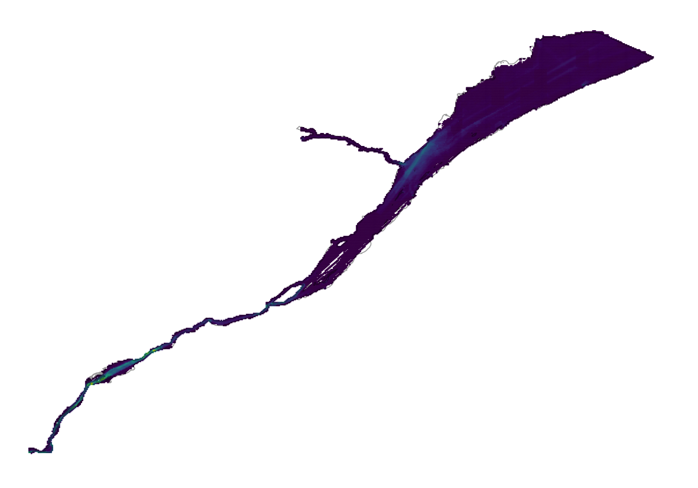
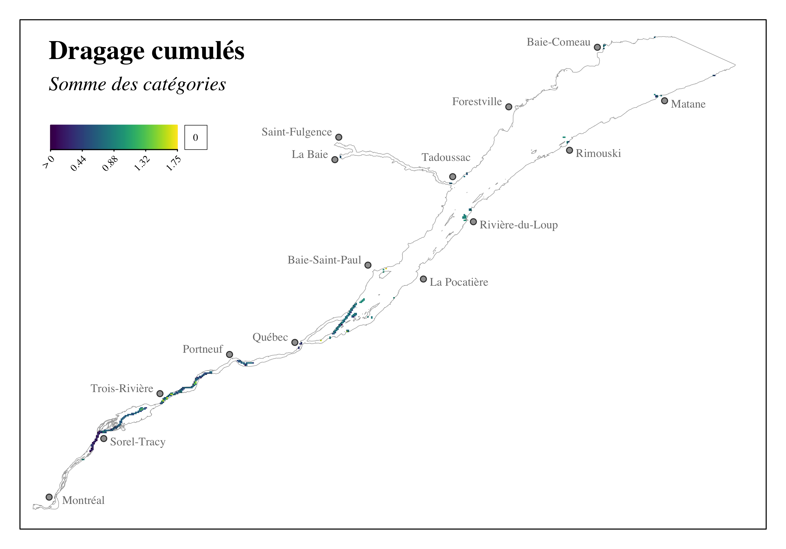
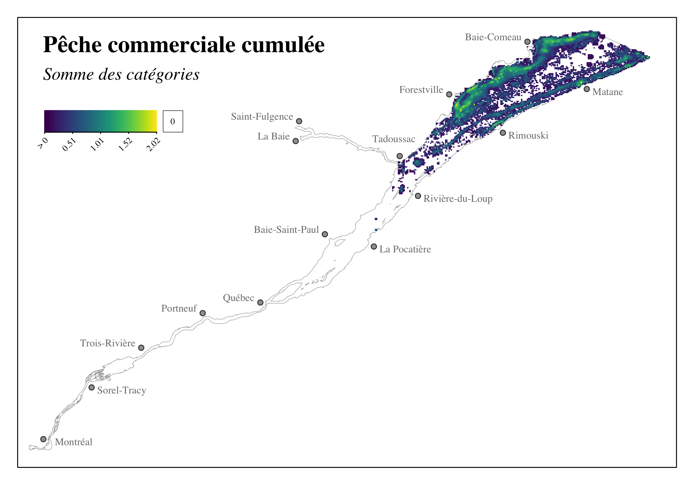
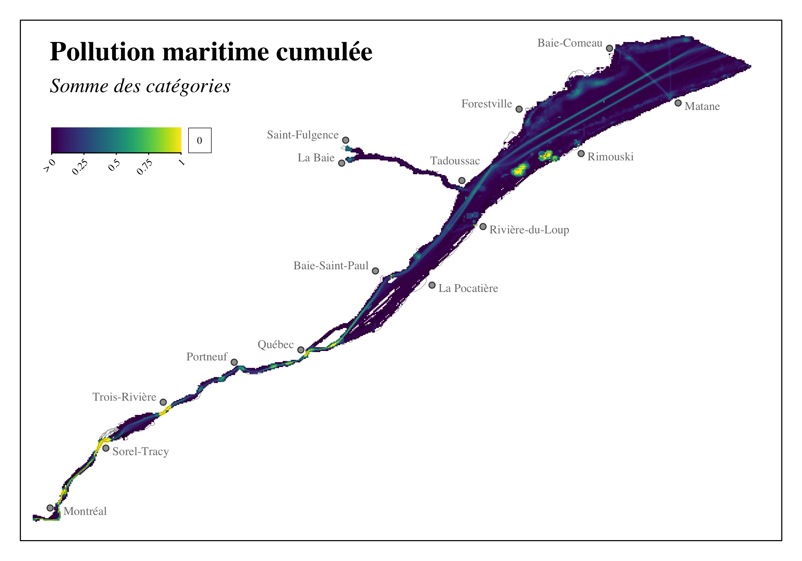
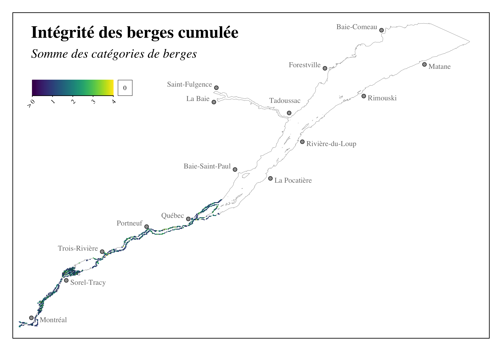
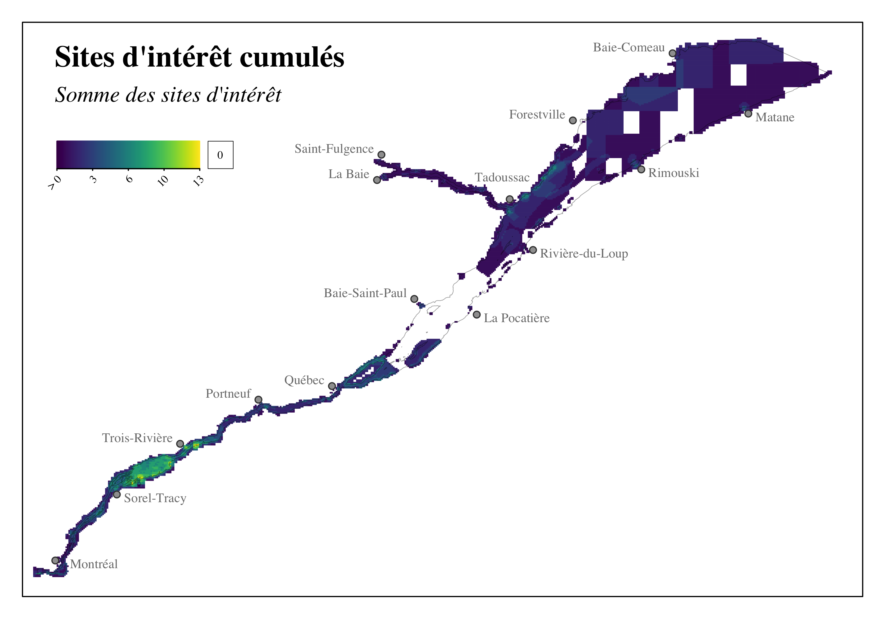

```{r setup, include=FALSE}
source('_setup.R')
# knitr::clean_cache(TRUE)
htmltools::tagList(
  xaringanExtra::use_clipboard(
    button_text = "<i class=\"fa fa-clipboard\"></i>",
    success_text = "<i class=\"fa fa-check\" style=\"color: #37abc8\"></i>",
  ),
  rmarkdown::html_dependency_font_awesome()
)
# xaringanExtra::use_scribble()

cols <- c('#777777','#d66666','#f0f518','#2eb8dd','#6a8868')
```


class: title-slide, middle


# Effets cumulatifs des activités maritimes sur le Saint-Laurent et la rivière Saguenay

### Projet pilote

<center></img></center>

<center><i>David Beauchesne, Cindy Grant & Philippe Archambault</i></center>

<span class="br2"></span>

<center>
<a href="https://www.ulaval.ca/"></img></a>
&nbsp;&nbsp;&nbsp;&nbsp;&nbsp;&nbsp;&nbsp;&nbsp;&nbsp;&nbsp;
</img>
<!-- &nbsp;&nbsp;&nbsp;&nbsp;&nbsp;
</img> -->
</center>

<span class="br2"></span>

#### Présentation du rapport final

#### 2022-03-23

#### [**English version**](https://effetscumulatifsnavigation.github.io/2022-03-TC-webinar_ceanav/)


---


class: inverse, center, middle

# Équipe de travail

<html><div style='float:left'></div><hr color='#ffdd55' style="margin-top:-30px" size=1px width=720px></html>


---

# Équipe de travail

<br/>

<center>
<div class="divTable team">
  <div class="divTableBody">
    <div class="divTableRow">
      <div class="divTableCell">
        
      </div>
      <div class="divTableCell">
        
      </div>
      <div class="divTableCell">
        
      </div>
    </div>
    <div class="divTableRow">
      <div class="divTableCell"><b>David Beauchesne</b></div>
      <div class="divTableCell"><b>Cindy Grant</b></div>
      <div class="divTableCell"><b>Philippe Archambault</b></div>
    </div>
  </div>
</div>
</center>


---

class: inverse, center, middle

# Effets cumulatifs - activités maritimes

<html><div style='float:left'></div><hr color='#ffdd55' style="margin-top:-30px" size=1px width=720px></html>

#### Contexte
### Portée de l'évaluation
### Méthode d'analyse 
### Portrait 
### Résultats
### Limites & perspectives


---
# Contexte 

.pull-left4[
## Initiative nationale 

- .font90[Cadre national d'évaluation des effets cumualtifs]
- .font90[Évaluations régionales (6)]

## Fleuve Saint-Laurent (QC)

- .font90[Gouvernement du Canada]
- .font90[Gouvernement du Québec]
- .font90[Premières Nations]
  - .font90[Nation Huronne-Wendat]
  - .font90[Nation des Innus d'Essipit]
  - .font90[Nation Mohawk de Kahnawà:ke]
  - .font90[Nation Wolastoqiyik Wahsipekuk]
  - .font90[Nation W8banaki]
- .font90[Intervenants locaux]
- .font90[Organisations non-gouvernementales]
]

.pull-right4[
<center></img></center>

<a href='https://www.donneesquebec.ca/'></a>
<a href='https://ogsl.ca/fr/accueil/'></a> 
<a href='https://open.canada.ca/fr'></a>
]

---

class: inverse, center, middle

# Effets cumulatifs - activités maritimes

<html><div style='float:left'></div><hr color='#ffdd55' style="margin-top:-30px" size=1px width=720px></html>

### Contexte
#### Portée de l'évaluation
### Méthode d'analyse
### Portrait 
### Résultats
### Limites & perspectives

---

# Portée de l'évaluation

## Objectifs général

*Développer une méthodologie d'analyse et effectuer une évaluation des effets cumulatifs des activités maritimes dans le Saint-Laurent (tronçon fluvial et estuaire) et la rivière Saguenay (partie en eau profonde) au Québec*

<br>

--
## Objectifs spécifiques 

- Caractériser l'intensité et la distribution spatiale de stresseurs environnementaux issus d'activités maritimes;

--
- Caractériser la structure spatiale des composantes valorisées identifiées;

--
- Évaluer la vulnérabilité des composantes valorisées aux stresseurs environnementaux;

--
- Évaluer les effets cumulatifs des stresseurs environnementaux sur les composantes valorisées


---

# Portée de l'évaluation

## Portée spatiale et temporelle &nbsp;&nbsp; <a href="maps/sa.html" target="_blank">`r mp()`</a>

.pull-left2[
#### Étendue spatiale

- Ouest: Châteaugay
- Est : Pointe-des-Monts et Cap-Chat
- Saguenay : Saint-Fulgence

#### Grille d'étude

- Cellules $1km^2$

#### Limites temporelles 

- Évaluation contemporaine 
- ~2000-2020 selon la disponibilité des données
]

.pull-right2[
<br>
<center>
<a href="https://effetscumulatifsnavigation.github.io/Rapport/figures/aoi.png">
</img>
</a>
</center>
]


---

# Portée de l'évaluation

## Stresseurs environnementaux & composantes valorisées

<br/>

<center></img></center>


--
.font80[`r tr()` Bien que le terme ***stresseur*** suggère des effets négatifs, un stresseur peut n'avoir aucun effet, ou même exercer un effet positif, sur une composante valorisée]

---
# Portée de l'évaluation 

## Limites et considérations particulières <br><br>

&emsp;***Interprération balisée par la portée de l'étude*** <br>
&emsp;&emsp;&emsp;.font90[Limites spatiales et temporelles] <br>
&emsp;&emsp;&emsp;.font90[Stresseurs environnementaux] <br>
&emsp;&emsp;&emsp;.font90[Composantes valorisées] <br>


--
&emsp;***Évaluation régionale des effets cumulatifs*** <br>


--
&emsp;***Évaluation sectorielle centrée sur les activités maritimes*** <br>


--
&emsp;***Composantes valorisées spécifiques à ce projet*** <br>


--
&emsp;***Évaluation basée sur des données existantes*** <br>


---

class: inverse, center, middle

# Effets cumulatifs - activités maritimes

<html><div style='float:left'></div><hr color='#ffdd55' style="margin-top:-30px" size=1px width=720px></html>

### Contexte
### Portée de l'évaluation
#### Méthode d'analyse
### Portrait 
### Résultats
### Limites & perspectives

---

# Méthode d'analyse

<center></img></center>

.references[
Halpern et al. 2008; Halpern et al. 2015
]


---

# Méthode d'analyse

<center></img></center>


.references[
Halpern et al. 2008; Halpern et al. 2015
]

---

# Méthode d'analyse

<br/><br/>

<center></img></center>

.references[
Halpern et al. 2008; Halpern et al. 2015
]

---

# Méthode d'analyse

<center></img></center>

.references[
Halpern et al. 2008; Halpern et al. 2015
]

---

# Méthode d'analyse

<center></img></center>

.references[
Halpern et al. 2008; Halpern et al. 2015
]

---

class: inverse, center, middle

# Effets cumulatifs - activités maritimes

<html><div style='float:left'></div><hr color='#ffdd55' style="margin-top:-30px" size=1px width=720px></html>

### Contexte
### Portée de l'évaluation
### Méthode d'analyse
#### Portrait 
### Résultats
### Limites & perspectives

---

# Portrait <a href='https://github.com/EffetsCumulatifsNavigation/ceanav'></a>

## Collecte et gestion de données 

--
- Données existantes 

--

- Consultation parties impliquées 

--
- Priorisation données ouvertes 
<a href='https://open.canada.ca/fr'></a>
<a href='https://ogsl.ca/fr/accueil/'></a> 
<a href='https://www.donneesquebec.ca/'></a>

--

- Ententes de partages de données

--
- Transparence et reproductibilité &nbsp; `r rp()` `r gh()` <a href='https://github.com/EffetsCumulatifsNavigation/ceanav'></a>
- Compendium de recherche ***ceanav***
- Partage sur le portail de l'OGSL .font60[`r tr()` en cours]


---
# Portrait: Stresseurs environnementaux 
<!-- .font70[(25 sous-catégories)] -->

<center>
<div class="divPortrait">
  <div class="divPortraitBody">
  
    <!-- Row 1 : text -->
    <div class="divPortraitRow">
      <div class="divPortraitCell"></div>
      <div class="divPortraitTitle">
        <b>Ancrages</b> (1) &nbsp;<a href="https://effetscumulatifsnavigation.github.io/Rapport/portrait.html#ancrage" target="_blank">`r bk()`</a>
      </div>
      <div class="divPortraitCell"></div>
      <div class="divPortraitTitle">
        <b>Déversements <br>accidentels</b> (3) &nbsp;<a href="https://effetscumulatifsnavigation.github.io/Rapport/portrait.html#deversement" target="_blank">`r bk()`</a>
      </div>
      <div class="divPortraitCell"></div>
      <div class="divPortraitTitle">
        <b>Dragage</b> (3) &nbsp;<a href="https://effetscumulatifsnavigation.github.io/Rapport/portrait.html#dragage" target="_blank">`r bk()`</a>
      </div>
    </div>
    
    <!-- Row 2: figures -->
    <div class="divPortraitRow">
      <div class="divPortraitData">0070<br>0071</div>
      <div class="divPortraitCell">
        <a href="figures/cumulative_st_ancrage.png" target="_blank">
          </img>
        </a>
      </div>
      <div class="divPortraitData">0016</div>
      <div class="divPortraitCell">
        <a href="figures/cumulative_st_deversement.png" target="_blank">
          </img>
        </a>
      </div>
      <div class="divPortraitData">0018<br>0019<br>0046<br>0048<br>0049<br>0050<br>0052<br>0069</div>
      <div class="divPortraitCell">
        <a href="figures/cumulative_st_dragage.png" target="_blank">
          </img>
        </a>      
      </div>
    </div>
    
    <!-- Row 3 : text -->
    <div class="divPortraitRow">
      <div class="divPortraitCell"></div>
      <div class="divPortraitTitle">
        <b>Naufrages</b> (1) &nbsp;<a href="https://effetscumulatifsnavigation.github.io/Rapport/portrait.html#naufrage" target="_blank">`r bk()`</a>
      </div>  
      <div class="divPortraitCell"></div>
      <div class="divPortraitTitle">
        <b>Navigation</b> (11) &nbsp;<a href="https://effetscumulatifsnavigation.github.io/Rapport/portrait.html#navigation" target="_blank">`r bk()`</a>
      </div>
      <div class="divPortraitCell"></div>
      <div class="divPortraitTitle">
        <b>Pêche commerciale</b> (5) &nbsp;<a href="https://effetscumulatifsnavigation.github.io/Rapport/portrait.html#pechecommerciale" target="_blank">`r bk()`</a>
      </div>
    </div>
    
    <!-- Row 4: figures -->
    <div class="divPortraitRow">
      <div class="divPortraitData">0062</div>
      <div class="divPortraitCell">
        <a href="figures/cumulative_st_naufrage.png" target="_blank">
          </img>
        </a>      
      </div>  
      <div class="divPortraitData">0020<br>0021<br>0028<br>0041<br>0047</div>
      <div class="divPortraitCell">
        <a href="figures/cumulative_st_navigation.png" target="_blank">
          </img>
        </a>      
      </div>
      <div class="divPortraitData">0033<br>0034<br>0035</div>
      <div class="divPortraitCell">
        <a href="figures/cumulative_st_peche_commerciale.png" target="_blank">
          </img>
        </a>      
      </div>  
    </div>

    <!-- Row 5 : text -->
    <div class="divPortraitRow">
      <div class="divPortraitCell"></div>
      <div class="divPortraitCell"></div>
      <div class="divPortraitCell"></div>
      <div class="divPortraitTitle">
        <b>Pollution maritime</b> (1) &nbsp;<a href="https://effetscumulatifsnavigation.github.io/Rapport/portrait.html#pollutionmaritime" target="_blank">`r bk()`</a>
        </div>
    </div>
    
    <!-- Row 6: figures -->
    <div class="divPortraitRow">
      <div class="divPortraitCell"></div>
      <div class="divPortraitInfo">
        `r nf()` Les identifiants numériques <br>sont associés aux bases de <br> données utilisées (<a href="https://effetscumulatifsnavigation.github.io/Rapport/annexe1.html">annexe 1</a>)
      </div>
      <div class="divPortraitData">0018,0019<br>0020,0021<br>0028,0033<br>0034,0035<br>0041,0046<br>0047,0048<br>0049,0050</div>
      <div class="divPortraitCell">
        <a href="figures/cumulative_st_pollution_maritime.png" target="_blank">
          </img>
        </a>      
      </div>
      <div class="divPortraitData">0052,0069<br>0070,0071</div>
      

  </div>
</div>
</center>


---
# Portrait: Composantes valorisées 
<!-- .font70[(77 sous-catégories)] -->

<center>
<div class="divPortrait">
  <div class="divPortraitBody">
  
    <!-- Row 1 : text -->
    <div class="divPortraitRow">
      <div class="divPortraitCell"></div>
      <div class="divPortraitTitle">
        <b>Habitats floristiques et fauniques</b> (21) &nbsp;<a href="https://effetscumulatifsnavigation.github.io/Rapport/portrait.html#habitat" target="_blank">`r bk()`</a>
      </div>
      <div class="divPortraitCell"></div>
      <div class="divPortraitTitle">
        <b>Intégrité des berges</b> (4) &nbsp;<a href="https://effetscumulatifsnavigation.github.io/Rapport/portrait.html#berge" target="_blank">`r bk()`</a>
      </div>
    </div>
    
    <!-- Row 2: figures -->
    <div class="divPortraitRow">
      <div class="divPortraitData">
         0001,0002<br>
         0003,0009<br>
         0010,0013<br>
         0014,0017<br>
         0043,0053<br>
         0057,0058<br>
         0059,0060<br>
      </div>
      <div class="divPortraitCell">
        <a href="figures/cumulative_cv_habitat.png" target="_blank">
          </img>
        </a>
      </div>
      <div class="divPortraitData">0017</div>
      <div class="divPortraitCell">
        <a href="figures/cumulative_cv_berge.png" target="_blank">
          </img>
        </a>
      </div>
    </div>
    
    <!-- Row 3 : text -->
    <div class="divPortraitRow">
      <div class="divPortraitCell"></div>
      <div class="divPortraitTitle">
        <b>Mammifères marins</b> (9) &nbsp;<a href="https://effetscumulatifsnavigation.github.io/Rapport/portrait.html#mammiferesmarins" target="_blank">`r bk()`</a>
      </div>
      <div class="divPortraitCell"></div>
      <div class="divPortraitTitle">
        <b>Sites d'intérêt cultirels, patrimoniaux <br>et archéologiques</b> (43) &nbsp;<a href="https://effetscumulatifsnavigation.github.io/Rapport/portrait.html#habitat" target="_blank">`r bk()`</a>
      </div>
    </div>
    
    <!-- Row 4: figures -->
    <div class="divPortraitRow">
      <div class="divPortraitData">0027<br>0054</div>
      <div class="divPortraitCell">
        <a href="figures/cumulative_cv_mammiferes_marins.png" target="_blank">
          </img>
        </a>      
      </div>  
      <div class="divPortraitData">
        0022,0023<br>
        0024,0025<br>
        0030,0032<br>
        0038,0039<br>
        0044,0045<br>
        0055,0066<br>
        0067,0068<br>
        0072<br>
      </div>
      <div class="divPortraitCell">
        <a href="figures/cumulative_cv_site.png" target="_blank">
          </img>
        </a>      
      </div>
    </div>

  </div>
</div>
</center>

.references[
`r nf()` Les identifiants numériques sont associés aux bases de données utilisées (<a href="https://effetscumulatifsnavigation.github.io/Rapport/annexe1.html">annexe 1</a>)
]


---

# Portrait 

## Vulnérabilité

.references[
Halpern et al. 2007; Teck et al., 2010; Kappel et al., 2012; Maxwell et al. 2013; Clarke Murray et al., 2015a
]

.pull-left2[
### Métriques

- Échelle spatiale 
- Fréquence 
- Impact trophique 
- Résistance 
- Temps de rétablissement 
- Effet direct ou indirect
- Effet sur la reproduction 
- Effet sur la population 
- Statut de l'espèce
- Espèce résidente
]


---

# Portrait 

## Vulnérabilité

.references[
Halpern et al. 2007; Teck et al., 2010; Kappel et al., 2012; Maxwell et al. 2013; Clarke Murray et al., 2015a
]

.pull-left2[
### Métriques

- Échelle spatiale 
- Fréquence 
- Impact trophique 
- Résistance 
- Temps de rétablissement 
- Effet direct ou indirect
- Effet sur la reproduction
- Effet sur la population
- Statut de l'espèce
- Espèce résidente

]

.pull-right2[
### Stresseur - Composante valorisée

- Scores attribué à chaque métrique sélectionnée
- Utilisation de littérature scientifique ou avis d'experts 
- Somme des valeurs des métriques
- Diviser par la valeur maximale observée
- Vulnérabilité relative [0,1]
]

---

# Portrait 

## Vulnérabilité .font70[(exemple)]

### Béluga - Porte-conteneurs

- *Fréquence*: **persistant** (***4***/4)
- *Effet direct ou indirects*: **effet direct mineur** (***3***/4)
- *Résistance*: mortalité **peu probable** (***1***/3)
- *Temps de rétablissement*: **10-100 ans** (***3***/4)
- *Effet sur la reproduction*: **faible** (***1***/3)
- *Effet sur la population*: **individus** (***1***/3)
- *Statut de l'espèce*: **en voie de disparition** (***3***/3)
- *Espèce résidente*: **résidente** (***3***/3)

***Score total: 19***

---

# Portrait 

## Vulnérabilité .font70[(exemple)]

[<center></img></center>](https://effetscumulatifsnavigation.github.io/Rapport/figures/figures-vulnerability/mammiferes_marins.png)

---

# Portrait 

## Vulnérabilité 

<br>

&emsp; `r nf()` *La vulnérabilité des milieux naturels provient de la littérature* <br>
&emsp;&emsp;&emsp;.font80[(Kappel et al. 2012)] <br>


--
&emsp; `r nf()` La vulnérabilité des berges provient d'un indice de risque d'érosion des berges <br>
&emsp;&emsp;&emsp;.font80[(Bernier et al. 2020, 2021)] <br>


--
&emsp; `r nf()` Les sites d'intérêt culturels, patrimoniaux et archéologiques ont tous une valeur 
&emsp;&emsp;&emsp;maximale de 1 <br>


---

class: inverse, center, middle

# Effets cumulatifs - activités maritimes

<html><div style='float:left'></div><hr color='#ffdd55' style="margin-top:-30px" size=1px width=720px></html>

### Contexte
### Portée de l'évaluation
### Méthode d'analyse
### Portrait 
#### Résultats
### Limites & perspectives

---

# Résultats

## Stresseurs cumulés

<br2>

.pull-left2[
- Distribution dans l'ensemble de la zone d'étude

- Villes portuaires et voie navigable

- Navigation et pollution maritime plus répandus

]
.pull-right2[
<br>
[<center></img></center>](https://effetscumulatifsnavigation.github.io/Rapport/figures/figures-output/cumulative_st.png)
]


---

# Résultats

## Composantes valorisées cumulées

.pull-left2[
- Distribution dans l'ensemble de la zone d'étude

- Milieux côtiers diversifiés en composantes valorisées

- Région du lac Saint-Pierre

- Embouchure de la Rivière Saguenay
]
.pull-right2[
<br>
[<center></img></center>](https://effetscumulatifsnavigation.github.io/Rapport/figures/figures-output/cumulative_cv.png)
]

---

# Résultats

## Effets cumulatifs

.pull-left2[
- Généralisés et intensités variables
- Secteur fluvial: intense et concentré 
  - .font90[Québec et sud de l'Île d'Orléan]
  - .font90[Lac Saint-Pierre]
  - .font90[Chenal de navigation (Montréal - Trois-Rivières)]
- Secteur maritime: diffus
  - .font90[Embouchure de la rivière Saguenay]
]
.pull-right2[
<br>
[<center></img></center>](https://effetscumulatifsnavigation.github.io/Rapport/figures/figures-output/cumulative_effects.png)
]

---

# Résultats

## Chemins d'effet

.pull-left2[
- Vue d'ensemble de l'évaluation
- 1358 chemins d'effets directs 
- Score moyen: 0.11 ± 0.15 (max = 1)
]

.pull-right2[
[<center></img></center>](https://effetscumulatifsnavigation.github.io/Rapport/figures/figures-output/cumulative_effects_metanetwork.png)
]


---

# Résultats

## Contribution régionale: .font90[Stresseurs environnementaux]

.pull-left2[
- .font90[Navigation et pollution maritime]
- .font90[Effets ciblés des pêches commerciales]
]
.pull-right2[ 
- .font90[Effets localisés des ancrages, déversements accidentels et activités de dragage]
- .font90[Chevauchement au sein de milieux les plus affectés comme le lac Saint-Pierre]
]

[<center></img></center>](https://effetscumulatifsnavigation.github.io/Rapport/figures/figures-output/cumulative_effects_regional_contribution.png)

---

# Résultats

## Contribution régionale: .font90[Composantes valorisées]

.pull-left4[
- .font90[Exposition importante des sites d'intérêt, surtout dans le secteur fluvial]
- .font90[Intégrité des berges affecté par la navigation]
]
.pull-right4[ 
- .font90[Effets et source des effets variable sur les habitats]
- .font90[Effets moindre sur les mammifères marins; localisé à l'embouchure du Saguenay]
]

[<center></img></center>](https://effetscumulatifsnavigation.github.io/Rapport/figures/figures-output/cumulative_effects_regional_contribution.png)

---

# Résultats

## Régions administratives

.pull-left4[
- Régions du secteur fluvial plus affectées, particulièrement Montérégie
  - .font90[Concentration des effets de la navigation] 
  - .font90[Principalement transport de marchandise]
- Régions du secteur maritime moins affectées
  - .font90[Côte Nord: effets sur les mammifères marins à l'embouchure du Saguenay] 
]
.pull-right4[
[<center></img></center>](https://effetscumulatifsnavigation.github.io/Rapport/figures/figures-output/cumulative_effects_region_cea.png)
]

---

class: inverse, center, middle

# Effets cumulatifs - activités maritimes

<html><div style='float:left'></div><hr color='#ffdd55' style="margin-top:-30px" size=1px width=720px></html>

### Contexte
### Portée de l'évaluation
### Méthode d'analyse
### Portrait 
### Résultats
#### Limites & perspectives

---

# Limites & perspectives 

***Sites d'intérêt culturels, patrimoniaux et archéologiques*** <br>
&emsp;&emsp;.font90[Difficulté de considérer les effets sociaux-culturels] <br>
&emsp;&emsp;.font90[Projet *Cultures et Nations Saint-Laurent*] &nbsp; .font80[`r tr()` (Prochaine présentation!)] <br>


--
***Évaluation régionale des effets cumulatifs*** <br>
&emsp;&emsp;.font90[Évaluation ne considère pas tous les stresseurs affectant la zone d'étude] <br>
&emsp;&emsp;.font90[Supporter et informer l'évaluation régionale du fleuve Saint-Laurent] <br>


--
***Caractérisation de la rivière Saguenay*** <br>
&emsp;&emsp;.font90[Peu d'effets relevés sur la rivière Saguenay dû au manque de connaissances] <br>


--
***Hotspots d'effets cumulatifs*** <br>
&emsp;&emsp;.font90[Évaluations à fine échelle des milieux les plus affectés par les activités maritimes] <br>


---

# Limites & perspectives 

***Opérationnaliser les évaluations d'effets cumulatifs*** <br>
&emsp;&emsp;.font90[Adopter des approches transparentes et reproductibles] <br>
&emsp;&emsp;.font90[Mises à jour du compendium de recherche] <br>


--
***Exploration interactive des évaluations d'effets cumulatifs*** <br>
&emsp;&emsp;.font90[Simplification des résultats présentés au sein d'un rapport] <br>
&emsp;&emsp;.font90[Outils interactifs permetant l'exploration des résultats] <br>


---
class: inverse, center, middle

# Remerciements 

<html><div style='float:left'></div><hr color='#ffdd55' style="margin-top:-30px" size=1px width=720px></html>

## Parce que sans votre travail, le nôtre serait impossible

---
# Remerciements 

***Toutes les personnes et organismes ayant participé aux ateliers et webinaires*** <br>


--
***Les Premières Nations ayant participé à l'évaluation*** <br>
&emsp;&emsp;.font90[Nation Huronne-Wendat] <br>
&emsp;&emsp;.font90[Nation des Innus d’Essipit] <br>
&emsp;&emsp;.font90[Nation Mohawk de Kahnawà:ke] <br>
&emsp;&emsp;.font90[Nation Wolastoqiyik Wahsipekuk] <br>
&emsp;&emsp;.font90[Nation W8banaki ] <br>


--
***Collaborateurs et organismes qui ont échangé et partagé avec notre équipe*** <br>


--
***Membres du Plan d'action Saint-Laurent*** <br>


--
***Catherine Guillemette!*** <br>


---
class: inverse, center, middle

# Merci! 

<html><div style='float:left'></div><hr color='#ffdd55' style="margin-top:-30px" size=1px width=720px></html>


<!--
rmarkdown::render('./index.Rmd')
xaringan::decktape("https://effetscumulatifsnavigation.github.io/WebinaireMethode", "Webinaire.pdf", docker = FALSE)
-->
