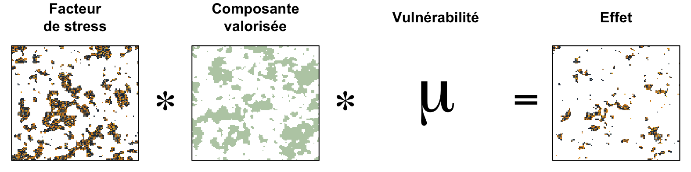
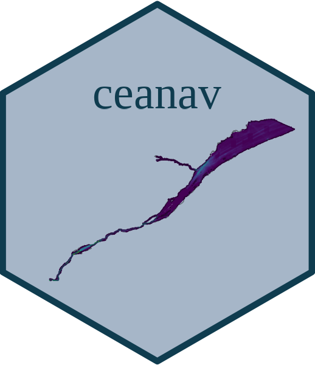

```{r setup, include=FALSE}
source('_setup.R')
# knitr::clean_cache(TRUE)
htmltools::tagList(
  xaringanExtra::use_clipboard(
    button_text = "<i class=\"fa fa-clipboard\"></i>",
    success_text = "<i class=\"fa fa-check\" style=\"color: #37abc8\"></i>",
  ),
  rmarkdown::html_dependency_font_awesome()
)
# xaringanExtra::use_scribble()

cols <- c('#777777','#d66666','#f0f518','#2eb8dd','#6a8868')
```


class: title-slide, middle


# Effets cumulatifs des activités maritimes sur le Saint-Laurent et la rivière Saguenay - Projet pilote

<center></img></center>

<center><i>David Beauchesne, Cindy Grant & Philippe Archambault</i></center>

<span class="br2"></span>

<center>
<a href="https://www.ulaval.ca/"></img></a>
&nbsp;&nbsp;&nbsp;&nbsp;&nbsp;&nbsp;&nbsp;&nbsp;&nbsp;&nbsp;
</img>
<!-- &nbsp;&nbsp;&nbsp;&nbsp;&nbsp;
</img> -->
</center>

<span class="br2"></span>

#### Présentation du rapport final

#### 2022-03-23

<!-- #### [English version](https://github.com/EffetsCumulatifsNavigation/2022-03-TC-webinaire_ceanav) -->


---


class: inverse, center, middle

# Équipe de travail

<html><div style='float:left'></div><hr color='#ffdd55' style="margin-top:-30px" size=1px width=720px></html>

---

# Équipe de travail

<br/>

<center>
<div class="divTable team">
<div class="divTableBody">
<div class="divTableRow">
<div class="divTableCell">

</div><div class="divTableCell">

</div><div class="divTableCell">

</div></div>
<div class="divTableRow">
<div class="divTableCell"><b>David Beauchesne</b></div><div class="divTableCell"><b>Cindy Grant</b></div><div class="divTableCell"><b>Philippe Archambault</b></div></div>
</div>
</center>


---

class: inverse, center, middle

# Effets cumulatifs - activités maritimes

<html><div style='float:left'></div><hr color='#ffdd55' style="margin-top:-30px" size=1px width=720px></html>

#### Contexte
### Portée de l'évaluation
### Méthode d'analyse 
### Portrait 
### Résultats
### Limites & perspectives

---

# Contexte 

.pull-left[
## Initiative nationale 

.font90[
- Cadre national d'évaluation des effets cumulatifs
- Évaluations régionales (6)
]

## Fleuve Saint-Laurent (QC)

.font90[
- Gouvernement du Canada 
- Gouvernement du Québec 
- Premières Nations 
  - Nation Huronne-Wendat
  - Nation des Innus d’Essipit
  - Nation Mohawk de Kahnawà:ke
  - Nation Wolastoqiyik Wahsipekuk
  - Nation W8banaki 
- Intervenants locaux
- Organisations non-gouvernementales
]
]

.pull-right[
<center></img></center>

<a href='https://www.donneesquebec.ca/'></a>
<a href='https://ogsl.ca/fr/accueil/'></a> 
<a href='https://open.canada.ca/fr'></a>


<!-- <a href='https://open.canada.ca/fr'></a>
<a href='https://ogsl.ca/fr/accueil/'></a> 
<a href='https://www.donneesquebec.ca/'></a> -->
]

---

class: inverse, center, middle

# Effets cumulatifs - activités maritimes

<html><div style='float:left'></div><hr color='#ffdd55' style="margin-top:-30px" size=1px width=720px></html>

### Contexte
#### Portée de l'évaluation
### Méthode d'analyse
### Portrait 
### Résultats
### Limites & perspectives

---

# Portée de l'évaluation

## Objectifs général

*Développer une méthodologie d'analyse effectuer une évaluation des effets cumulatifs des activités maritimes dans le Saint-Laurent (tronçon fluvial et estuaire) et la rivière Saguenay (partie en eau profonde) au Québec*

<br>

--
## Objectifs spécifiques 

- Caractériser l'intensité et la distribution spatiale de stresseurs environnementaux issus d'activités maritimes;

--
- Caractériser la structure spatiale des composantes valorisées identifiées;

--
- Évaluer la vulnérabilité des composantes valorisées aux stresseurs environnementaux;

--
- Évaluer les effets cumulatifs des stresseurs environnementaux sur les composantes valorisées


---

# Portée de l'évaluation

## Portée spatiale et temporelle &nbsp;&nbsp; <a href="maps/sa.html" target="_blank">`r mp()`</a>

.pull-left2[
#### Étendue spatiale

- Ouest: Châteaugay
- Est : Pointe-des-Monts et Cap-Chat
- Saguenay : Saint-Fulgence

#### Grille d'étude

- Cellules $1km^2$

#### Limites temporelles 

- Évaluation contemporaine 
- ~2000-2020 selon la disponibilité des données
]

.pull-right2[

]


---

# Portée de l'évaluation

## Stresseurs environnementaux & composantes valorisées

<br/>

<center></img></center>


--
.font80[`r tr()` Bien que le terme ***stresseur*** suggère des effets négatifs, un stresseur peut n'avoir aucun effet, ou même exercer un effet positif, sur une composante valorisée]

---
# Portée de l'évaluation 

## Limites et considérations particulières <br><br>

&emsp;***Interprération balisée par la portée de l'étude*** <br>
&emsp;&emsp;&emsp;.font90[Limites spatiales et temporelles] <br>
&emsp;&emsp;&emsp;.font90[Stresseurs environnementaux] <br>
&emsp;&emsp;&emsp;.font90[Composantes valorisées] <br>


--
&emsp;***Évaluation régionale des effets cumulatifs*** <br>


--
&emsp;***Évaluation sectorielle centrée sur les activités maritimes*** <br>


--
&emsp;***Composantes valorisées spécifiques à ce projet*** <br>


--
&emsp;***Évaluation basée sur des données existantes*** <br>


---

class: inverse, center, middle

# Effets cumulatifs - activités maritimes

<html><div style='float:left'></div><hr color='#ffdd55' style="margin-top:-30px" size=1px width=720px></html>

### Contexte
### Portée de l'évaluation
#### Méthode d'analyse
### Portrait 
### Résultats
### Limites & perspectives

---

# Méthode d'analyse

<center></img></center>

.references[
Halpern et al. 2008; Halpern et al. 2015
]


---

# Méthode d'analyse

<center></img></center>


.references[
Halpern et al. 2008; Halpern et al. 2015
]

---

# Méthode d'analyse

<br/><br/>

<center></img></center>

.references[
Halpern et al. 2008; Halpern et al. 2015
]

---

# Méthode d'analyse

<center></img></center>

.references[
Halpern et al. 2008; Halpern et al. 2015
]

---

# Méthode d'analyse

<center></img></center>

.references[
Halpern et al. 2008; Halpern et al. 2015
]

---

class: inverse, center, middle

# Effets cumulatifs - activités maritimes

<html><div style='float:left'></div><hr color='#ffdd55' style="margin-top:-30px" size=1px width=720px></html>

### Contexte
### Portée de l'évaluation
### Méthode d'analyse
#### Portrait 
### Résultats
### Limites & perspectives

---

# Portrait <a href='https://github.com/EffetsCumulatifsNavigation/ceanav'></a>

## Collecte et gestion de données 

--
- Données existantes 

--

- Consultation parties impliquées 

--
- Priorisation données ouvertes 
<a href='https://open.canada.ca/fr'></a>
<a href='https://ogsl.ca/fr/accueil/'></a> 
<a href='https://www.donneesquebec.ca/'></a>

--

- Ententes de partages de données

--
- Transparence et reproductibilité &nbsp; `r rp()` `r gh()` <a href='https://github.com/EffetsCumulatifsNavigation/ceanav'></a>
- Compendium de recherche ***ceanav***
- Partage sur le portail de l'OGSL .font60[`r tr()` en cours]

---

# Portrait 

## [Stresseurs environnementaux](https://effetscumulatifsnavigation.github.io/Rapport/portrait.html#strportrait) .font70[(25 sous-catégories)] <br>

.pull-left4[
&emsp;[***Ancrages***](https://effetscumulatifsnavigation.github.io/Rapport/portrait.html#ancrage) .font70[(1)] <br>

&emsp;[***Déversements accidentels***](https://effetscumulatifsnavigation.github.io/Rapport/portrait.html#deversement) .font70[(3)] <br>

&emsp;[***Dragage***](https://effetscumulatifsnavigation.github.io/Rapport/portrait.html#dragage) .font70[(3)] <br>

&emsp;[***Naufrages***](https://effetscumulatifsnavigation.github.io/Rapport/portrait.html#naufrage) .font70[(1)] <br>

&emsp;[***Navigation***](https://effetscumulatifsnavigation.github.io/Rapport/portrait.html#navigation) .font70[(11]) <br>

&emsp;[***Pêche commerciale***](https://effetscumulatifsnavigation.github.io/Rapport/portrait.html#pechecommerciale) .font70[(5)] <br>

&emsp;[***Pollution maritime***](https://effetscumulatifsnavigation.github.io/Rapport/portrait.html#pollutionmaritime) .font70[(1)] <br>
]

.pull-right4[
[<center></img></center>](https://effetscumulatifsnavigation.github.io/Rapport/figures/figures-output/cumulative_st_panel.png)
]

.references[
`r nf()` Tous les titres en gras sont des liens qui mènent aux sections du rapport. 
]

---

# Portrait 

## [Composantes valorisées](https://effetscumulatifsnavigation.github.io/Rapport/portrait.html#cvportrait) .font70[(77 sous-catégories)]

.pull-left4[
&emsp;[***Habitats floristiques et fauniques***](https://effetscumulatifsnavigation.github.io/Rapport/portrait.html#habitat) <br>
&emsp;&emsp; Cycles de vie .font70[(3)] <br>
&emsp;&emsp; .font90[Espèces à statut] .font70[(6)] <br>
&emsp;&emsp; .font90[Milieux naturels] .font70[(12)] <br>

&emsp;[***Intégrité des berges***](https://effetscumulatifsnavigation.github.io/Rapport/portrait.html#berge) .font70[(4)] <br>

&emsp;[***Mammifères marins***](https://effetscumulatifsnavigation.github.io/Rapport/portrait.html#mammiferesmarins) <br>
&emsp;&emsp; .font90[Baleines] .font70[(6)] <br>
&emsp;&emsp; .font90[Phoques] .font70[(3)] <br>

&emsp;[***Qualité de l'eau***](https://effetscumulatifsnavigation.github.io/Rapport/portrait.html#qualité-de-leau) .font80[`r tr()` non considéré]
]

.pull-right4[
[<center></img></center>](https://effetscumulatifsnavigation.github.io/Rapport/figures/figures-output/cumulative_cv_panel.png)
]

.pull-left5[
&emsp;[***Sites d'intérêt cultirels, patrimoniaux et archéologiques***](https://effetscumulatifsnavigation.github.io/Rapport/portrait.html#site) <br>
&emsp;&emsp; .font90[Premières Nations] .font70[(41)] <br>
&emsp;&emsp; .font90[Sites publics] .font70[(2)] <br>
]

.references[
`r nf()` Tous les titres en gras sont des liens qui mènent aux sections du rapport. 
]

---

# Portrait 

## Vulnérabilité

---

class: inverse, center, middle

# Effets cumulatifs - activités maritimes

<html><div style='float:left'></div><hr color='#ffdd55' style="margin-top:-30px" size=1px width=720px></html>

### Contexte
### Portée de l'évaluation
### Méthode d'analyse
### Portrait 
#### Résultats
### Limites & perspectives

---

# Résultats

## Stresseurs cumulés

<br2>

.pull-left2[
- Distribution dans l'ensemble de la zone d'étude

- Villes portuaires et voie navigable

- Navigation et pollution maritime plus répandus

]
.pull-right2[
[](https://effetscumulatifsnavigation.github.io/Rapport/figures/figures-output/cumulative_st.png)
]

---

# Résultats

## Composantes valorisées cumulées

.pull-left2[
- Distribution dans l'ensemble de la zone d'étude

- Milieux côtiers diversifiés en composantes valorisées

- Région du lac Saint-Pierre

- Embouchure de la Rivière Saguenay
]
.pull-right2[
[](https://effetscumulatifsnavigation.github.io/Rapport/figures/figures-output/cumulative_cv.png)
]

---

# Résultats

## Effets cumulatifs

.pull-left2[
- Généralisés et intensités variables
- Secteur fluvial: intense et concentré 
  - .font90[Québec et sud de l'Île d'Orléan]
  - .font90[Lac Saint-Pierre]
  - .font90[Chenal de navigation (Montréal - Trois-Rivières)]
- Secteur maritime: diffus
  - .font90[Embouchure de la rivière Saguenay]
]
.pull-right2[
[](https://effetscumulatifsnavigation.github.io/Rapport/figures/figures-output/cumulative_effects.png)
]

---

# Résultats

## Chemins d'effet

.pull-left2[
- Vue d'ensemble de l'évaluation
- 1358 chemins d'effets directs 
- Score moyen: 0.11 ± 0.15 (max = 1)
]

.pull-right2[
[](https://effetscumulatifsnavigation.github.io/Rapport/figures/figures-output/cumulative_effects_metanetwork.png)
]


---

# Résultats

## Contribution régionale: .font90[Stresseurs environnementaux]

.pull-left2[
- .font90[Navigation et pollution maritime]
- .font90[Effets ciblés des pêches commerciales]
]
.pull-right2[ 
- .font90[Effets localisés des ancrages, déversements accidentels et activités de dragage]
- .font90[Chevauchement au sein de milieux les plus affectés comme le lac Saint-Pierre]
]

[](https://effetscumulatifsnavigation.github.io/Rapport/figures/figures-output/cumulative_effects_regional_contribution.png)

---

# Résultats

## Contribution régionale: .font90[Composantes valorisées]

.pull-left4[
- .font90[Exposition importante des sites d'intérêt, surtout dans le secteur fluvial]
- .font90[Intégrité des berges affecté par la navigation]
]
.pull-right4[ 
- .font90[Effets et source des effets variable sur les habitats]
- .font90[Effets moindre sur les mammifères marins; localisé à l'embouchure du Saguenay]
]

[](https://effetscumulatifsnavigation.github.io/Rapport/figures/figures-output/cumulative_effects_regional_contribution.png)

---

# Résultats

## Régions administratives

.pull-left4[
- Régions du secteur fluvial plus affectées, particulièrement Montérégie
  - .font90[Concentration des effets de la navigation] 
  - .font90[Principalement transport de marchandise]
- Régions du secteur maritime moins affectées
  - .font90[Côte Nord: effets sur les mammifères marins à l'embouchure du Saguenay] 
]
.pull-right4[
[](https://effetscumulatifsnavigation.github.io/Rapport/figures/figures-output/cumulative_effects_region_cea.png)
]

---

class: inverse, center, middle

# Effets cumulatifs - activités maritimes

<html><div style='float:left'></div><hr color='#ffdd55' style="margin-top:-30px" size=1px width=720px></html>

### Contexte
### Portée de l'évaluation
### Méthode d'analyse
### Portrait 
### Résultats
#### Limites & perspectives

---

# Limites & perspectives 

***Sites d'intérêt culturels, patrimoniaux et archéologiques*** <br>
&emsp;&emsp;.font90[Difficulté de considérer les effets sociaux-culturels] <br>
&emsp;&emsp;.font90[Projet *Cultures et Nations Saint-Laurent*] &nbsp; .font80[`r tr()` (Prochaine présentation!)] <br>


--
***Évaluation régionale des effets cumulatifs*** <br>
&emsp;&emsp;.font90[Évaluation ne considère pas tous les stresseurs affectant la zone d'étude] <br>
&emsp;&emsp;.font90[Supporter et informer l'évaluation régionale du fleuve Saint-Laurent] <br>


--
***Caractérisation de la rivière Saguenay*** <br>
&emsp;&emsp;.font90[Peu d'effets relevés sur la rivière Saguenay dû au manque de connaissances] <br>


--
***Hotspots d'effets cumulatifs*** <br>
&emsp;&emsp;.font90[Évaluations à fine échelle des milieux les plus affectés par les activités maritimes] <br>


---

# Limites & perspectives 

***Opérationnaliser les évaluations d'effets cumulatifs*** <br>
&emsp;&emsp;.font90[Adopter des approches transparentes et reproductibles] <br>
&emsp;&emsp;.font90[Mises à jour du compendium de recherche] <br>


--
***Exploration interactive des évaluations d'effets cumulatifs*** <br>
&emsp;&emsp;.font90[Simplification des résultats présentés au sein d'un rapport] <br>
&emsp;&emsp;.font90[Outils interactifs permetant l'exploration des résultats] <br>


---
class: inverse, center, middle

# Remerciements 

<html><div style='float:left'></div><hr color='#ffdd55' style="margin-top:-30px" size=1px width=720px></html>

## Parce que sans votre travail, le nôtre serait impossible

---
# Remerciements 

***Toutes les personnes et organismes ayant participé aux ateliers et webinaires*** <br>


--
***Les Premières Nations ayant participé à l'évaluation*** <br>
&emsp;&emsp;.font90[Nation Huronne-Wendat] <br>
&emsp;&emsp;.font90[Nation des Innus d’Essipit] <br>
&emsp;&emsp;.font90[Nation Mohawk de Kahnawà:ke] <br>
&emsp;&emsp;.font90[Nation Wolastoqiyik Wahsipekuk] <br>
&emsp;&emsp;.font90[Nation W8banaki ] <br>


--
***Collaborateurs et organismes qui ont échangé et partagé avec notre équipe*** <br>


--
***Membres du Plan d'action Saint-Laurent*** <br>


--
***Catherine Guillemette!*** <br>


---
class: inverse, center, middle

# Merci! 


<!--
rmarkdown::render('./index.Rmd')
xaringan::decktape("https://effetscumulatifsnavigation.github.io/WebinaireMethode", "Webinaire.pdf", docker = FALSE)
-->
